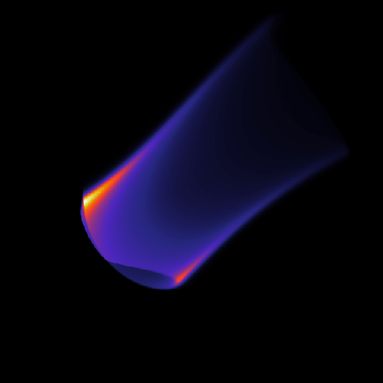

.. _example-angulardistribution:

Full angular distribution of radiation
--------------------------------------
Although most of the results obtained with SOFT that has been published in the
literature have used the *cone model*, SOFT is perfectly capable of taking the
full angular distribution of radiation into account, i.e. *NOT* assume that all
radiation is emitted exactly along the velocity vector. While this model is more
accurate than the cone model, it is also significantly slower.

**Resulting image** *when taking the full angular distribution of radiation
into account. The spot then usually appears somewhat thicker than when simulated
with the cone model.*

Important points
^^^^^^^^^^^^^^^^
The only thing that differs when taking the full angular distribution of
radiation into account (in contrast to just using the cone model) is that a
different :ref:`module-radiationmodel` must be used. In essence, all we need
to do is set the secondary type of the radiation model to ``angdist``::

   @RadiationModel ourModel (angdist) {
       ...
   }

And this is really all there is to it. The type of radiation can be specified
as usual.

There are some additional things to keep in mind when simulating the full
angular distribution of radiation though. These are

- **Toroidal quadrature threshold:** If you set :option:`@Radiation torquad` to ``maximize`` (which is also the default) in the :ref:`module-radiation` module, make sure that :option:`@Radiation torthreshold` is set to a value greater than zero. Otherwise very little is gained from using ``torquad = maximize``.
- **Detector resolution:** the full angular distribution of radiation requires explicit numerical integration over the detector surface. As such, a quadrature rule to use, as well as the number of points to discretize the detector surface with, can be selected. The quadrature to use is selected using the :option:`@RadiationModel(angdist) qrule2D` option, while the number of points on the detector surface is selected with :option:`@RadiationModel(angdist) nsamples`.

Example
^^^^^^^

The following is a complete configuration script that can be used to generate
the synchrotron image seen at the top of this page. This script can also be
found in the ``examples/`` subdirectory of the
`SOFT2 GitHub repository <https://github.com/hoppe93/SOFT2/blob/master/examples/AngularDistribution/synchrotron>`_.::

   # Configuration for simulation of bremsstrahlung
   # radiation images.
   #
   # Based on Zhou et al., PoP 21 (2014)
   # https://doi.org/10.1063/1.4881469
   ##############################

   magnetic_field     = mf;
   tools              = rad;

   # Configuration of analytical magnetic equilibrium
   @MagneticField mf (analytical) {
       B0     = 5;     # On-axis field strength (T)
       Rm     = 0.68;  # Major radius (m)
       rminor = 0.22;  # Minor radius (m)

       # Safety-factor (overriden in other scripts)
       qtype  = constant;
       qa1    = 1;
       sigmaB = ccw;
   }

   # Phase space grid
   @ParticleGenerator PGen {
       a      = 0, 0.95, 400;  # Normalized minor radius
       gamma  = 60, 60, 1;     # Energy (mc^2) (approx. 30 MeV)
       thetap = 0.2, 0.2, 1;   # Pitch angle (rad)

       progress = 20;
   }

   # Orbit generator
   @ParticlePusher PPusher {
       nt       = 5000;        # Number of timesteps per orbit (resolution parameter)
   }

   # Radiation tool
   @Radiation rad {
       detector    = "det";      # Name of detector configuration (quotations optional)
       ntoroidal   = 7000;       # No. of toroidal sections in tokamak (resolution parameter)
       model       = angdist;    # Radiation model to use
       output      = image topview;  # List of configuration of output

       ####################################
       # NOTE: This is required to acquire
       # the speedup from the 'maximize'
       # quadrature rule
       ####################################
       torthreshold = 1e-3;
   }

   # Detector properties
   # Set up a tangentially viewing HXR camera.
   @Detector det {
       aperture     = 0.006;
       position     = 0.68, -0.68, 0;
       direction    = 0, 1, 0;
       vision_angle = 0.78 fov;
       spectrum     = no;
   }

   @RadiationModel angdist (angdist) {
       emission = synchrotron;

       # Number of points (in each direction) on detector
       # (=> in total there will be 'nsamples*nsamples'
       # points covering the detector)
       # 
       # This is the resolution parameter corresponding to
       # the integral over the detector surface
       nsamples = 4;
   }
   @RadiationOutput image (image) {
       pixels = 600;
       output = "data/image.mat";
   }
   @RadiationOutput topview (topview) {
       pixels = 1000;
       output = "data/topview.mat";
   }

