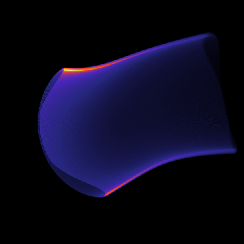

.. _example-image:

Basic synchrotron image
-----------------------
A basic example of a script for generating a synchrotron radiation image.

Important points
****************
As always, we must configure the following three modules:

- :ref:`module-magneticfield` --- The magnetic field to use
- :ref:`module-particlegenerator` --- Generates particles in our phase space
- :ref:`module-particlepusher` --- Computes orbits

In addition to these, we must also set up the tool to use. To generate a
synchrotron image, we need to use the :ref:`module-radiation` module. This
module further requires us to configure the following three sub-modules:

- :ref:`module-detector` --- Detector measuring the radiation
- :ref:`module-radiationmodel` --- Model to use for radiation (i.e. :ref:`module-rm-cone` or :ref:`module-rm-angulardistribution`)
- :ref:`module-radiationoutput` --- Defining the type of output to generate (i.e. :ref:`module-ro-image`)

Example configuration
*********************
The following generates a Green's function :math:`G(p_\parallel, p_\perp)`::

   # Generate a basic single-particle
   # synchrotron radiation image.
   ##################################

   magnetic_field     = mf;
   tools              = rad;

   # Configuration of EAST-like magnetic equilibrium
   @MagneticField mf (analytical) {
       B0     = 5;     # On-axis field strength (T)
       Rm     = 0.68;  # Major radius (m)
       rminor = 0.22;  # Minor radius (m)

       # Safety-factor
       qtype  = linear;
       qa1    = 2;
       qa2    = 1;

       sigmaB = ccw;
   }

   # Phase space grid
   @ParticleGenerator PGen {
       a      = 0.0, 0.95, 600; # Normalized minor radius
       p      = 60, 60, 1;
       thetap = 0.2, 0.2, 1;
   }

   # Orbit generator
   @ParticlePusher PPusher {
       nt = 2000;        # Number of timesteps per orbit (resolution parameter)
   }

   # Radiation tool
   @Radiation rad {
       detector = det;

       ntoroidal   = 7000;    # No. of toroidal sections in tokamak (resolution parameter)
       model       = cone;    # Radiation model to use
       output      = image;   # List of configuration of output
   }

   # Detector properties
   # Set up a tangentially viewing HXR camera.
   @Detector det {
       aperture     = 0.006;
       position     = 0.68, -0.68, 0;
       direction    = 0, 1, 0;
       vision_angle = 0.78 fov;
       spectrum     = no;
   }

   # Radiation model
   @RadiationModel cone (cone) {
       emission = synchrotron;
   }

   @RadiationOutput image (image) {
       pixels = 600;
       output = "data/image.mat";
   }

