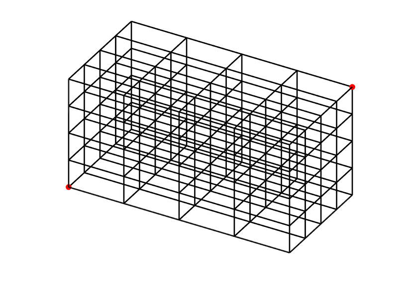

.. _module-ro-space3d:

(space3d)
*********
The @RadiationOutput module stores the 3D position of any electron emitting
radiation directly at the detector, effectively creating a three-dimensional
map of the origin of the radiation.

Directed radiation, such as bremsstrahlung and synchrotron radiation from
relativistic electrons, can only be observed when the emitting electron is
moving towards the detector. This is expressed in the equation

.. math::

   \hat{\boldsymbol{b}}(\boldsymbol{x}) \cdot \frac{\boldsymbol{x} - \boldsymbol{X}}{\left| \boldsymbol{x}-\boldsymbol{X} \right|} = \cos\theta_{\rm p},

where :math:`\hat{\boldsymbol{b}}` denotes the magnetic field unit vector,
:math:`\boldsymbol{x}` is the position of the particle, :math:`\boldsymbol{X}`
is the detector's position and :math:`\theta_{\rm p}` denotes the particle's
pitch angle at :math:`\boldsymbol{x}`. The solution to this equation is the
so-called surface-of-visibility, which can be studied using the Space3D module.

Summary of options
^^^^^^^^^^^^^^^^^^

+--------------------------------------------+-------------------------------------+
| **Option**                                 | **Description**                     |
+--------------------------------------------+-------------------------------------+
| :option:`@RadiationOutput(space3d) output` | Name of output file to generate.    |
+--------------------------------------------+-------------------------------------+
| :option:`@RadiationOutput(space3d) pixels` | Number of pixels in each dimension. |
+--------------------------------------------+-------------------------------------+
| :option:`@RadiationOutput(space3d) point0` | First edge point of pixel box.      |
+--------------------------------------------+-------------------------------------+
| :option:`@RadiationOutput(space3d) point1` | Second edge point of pixel box.     |
+--------------------------------------------+-------------------------------------+

Specification of pixel box
^^^^^^^^^^^^^^^^^^^^^^^^^^
The Space3D output module creates a 3D histogram of where radiation that reached
the detector was emitted from. The histogram is generated in a subset of space
that is defined by the *pixel box*, illustrated below.

This box is defined by its two edge points, ``point0`` and ``point1``, indicated
as red dots in the figure above, which specify its width, height and depth. The
number of cells, or "pixels", in the box is the same in each direction, and each
cell records the radiation emitted from its region of space.

.. note::

   One can think of the coordinates of each point as the "minimum" and "maximum"
   points respectively of the region to record. Thus, it is a good idea to
   always have ``point0`` be element-wise smaller (or larger) than ``point1``,
   i.e.

   .. math::

      P^{(0)}_i < P^{(1)}_i, \quad i = x,y,z

Example configuration
^^^^^^^^^^^^^^^^^^^^^
The following example configures a Space3D output module to generate a
surface-of-visibility consisting of :math:`100^3` cells::

    @RadiationOutput ourSpace3D (space3d) {
        output = "ourSpace3D.h5";
        pixels = 100;
        #         X      Y      Z
        point0 =  0.92, -1.06, -0.68;
        point1 =  2.21,  0.60,  0.48;
    }

Output file structure
^^^^^^^^^^^^^^^^^^^^^
The output file contains the following variables:

+--------------+--------------------------------------+
| **Variable** | **Description**                      |
+--------------+--------------------------------------+
| ``image``    | Pixel box/resulting image/histogram. |
+--------------+--------------------------------------+
| ``pixels``   | Number of pixels per dimension.      |
+--------------+--------------------------------------+
| ``xmin``     | The x-component of ``point0``.       |
+--------------+--------------------------------------+
| ``xmax``     | The x-component of ``point1``.       |
+--------------+--------------------------------------+
| ``ymin``     | The y-component of ``point0``.       |
+--------------+--------------------------------------+
| ``ymax``     | The y-component of ``point1``.       |
+--------------+--------------------------------------+
| ``zmin``     | The z-component of ``point0``.       |
+--------------+--------------------------------------+
| ``zmax``     | The z-component of ``point1``.       |
+--------------+--------------------------------------+

The image is stored as a linear vector of size :math:`1\times N`, where
:math:`N` is the number of pixels per dimension, i.e. ``pixels``. The image
should be reshaped into a 3-dimensional array before use though. In Matlab, do::

    reshapedImage = reshape(image, [pixels, pixels, pixels]);

In Python, do::

    import numpy as np

    reshapedImage = np.reshape(image, (pixels, pixels, pixels))

All options
^^^^^^^^^^^

.. program:: @RadiationOutput(space3d)

.. option:: output

   :Default value: Nothing
   :Allowed values: Any valid file name.

   Specifies the name of the output file to generate. The file name extension
   determines the type of the generated file.

.. option:: pixels

   :Default value: Nothing
   :Allowed values: Any positive integer.

   The number of pixels per dimension in the pixel box.

.. option:: point0

.. option:: point1

   :Default value: Nothing
   :Allowed values: Any vector in 3D space.

   Coordinates of the two edge points defining the pixel box. By convention,
   we usually assign the lower limits of each coordinate to ``point0`` and upper
   limits to ``point1``.

