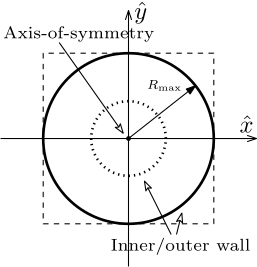

.. _module-ro-topview:

(topview)
*********
The *topview* @RadiationOutput is used to generate top-view maps of where
radiation is emitted from. The options and output variables for this module are
very similar to that of the :ref:`module-ro-image` module and they mainly differ
in how the image data they generate are interpreted.

Summary of options
^^^^^^^^^^^^^^^^^^

+--------------------------------------------+------------------------------------------------------------------+
| **Option**                                 | **Description**                                                  |
+--------------------------------------------+------------------------------------------------------------------+
| :option:`@RadiationOutput(topview) common` | List of common quantities to include in the output file.         |
+--------------------------------------------+------------------------------------------------------------------+
| :option:`@RadiationOutput(topview) output` | Sets the name of the output file.                                |
+--------------------------------------------+------------------------------------------------------------------+
| :option:`@RadiationOutput(topview) pixels` | Specifies the number of pixels in each direction of the topview. |
+--------------------------------------------+------------------------------------------------------------------+

Top view geometry
^^^^^^^^^^^^^^^^^
The top view geometry is independent of the detector properties. The global
(tokamak) x-axis is always along the horizontal in the image, while the global
(tokamak) y-axis is always along the vertical. The center of the image
corresponds to the axis of symmetry of the tokamak. The physical size of the
image is twice the maximum major radius of the domain used (i.e. either tokamak
wall or magnetic field separatrix).

An illustration of the geometry of the topview image is shown below. The dashed
square indicates the edges of the image and the dotted circle indicates the
location of the inner wall, i.e. the minimum radius of the domain used.

Example configuration
^^^^^^^^^^^^^^^^^^^^^
The following generates a topview that is 600x600 pixels in size::

   @RadiationOutput ourTopview (topview) {
       output = "ourTopview.h5";
       pixels = 600;
   }

.. note::

   In contrast to :ref:`module-ro-image`, topviews are always square images.

Output file structure
^^^^^^^^^^^^^^^^^^^^^
The output file contains the following variables:

+-----------------------+---------------------------------------------------------+
| **Variable**          | **Description**                                         |
+-----------------------+---------------------------------------------------------+
| ``image``             | Radiation image matrix.                                 |
+-----------------------+---------------------------------------------------------+

Common quantities
-----------------
By default, the following "common quantities" are also included in the output
file:

+-----------------------+---------------------------------------------------------+
| **Name**              | **Description**                                         |
+-----------------------+---------------------------------------------------------+
| ``detectorDirection`` | Unit vector representing viewing direction of detector. |
+-----------------------+---------------------------------------------------------+
| ``detectorPosition``  | Vector representing position of detector.               |
+-----------------------+---------------------------------------------------------+
| ``detectorVisang``    | (Full) FOV vision angle of the detector.                |
+-----------------------+---------------------------------------------------------+
| ``wall``              | Domain contour used for the simulation.                 |
+-----------------------+---------------------------------------------------------+

*For details about which other common quantities can be included in the output,
please consult the page about the* :ref:`module-radiationoutput` *class of
modules.*

All options
^^^^^^^^^^^

.. program:: @RadiationOutput(topview)

.. option:: common

   :Default value: ``none``
   :Allowed values: See the list on :ref:`module-radiationoutput`.

   Specifies which "common quantities" to include in the output file. A full
   list of possible options is given on :ref:`module-radiationoutput`.

.. option:: output

   :Default value: Nothing
   :Allowed values: Any valid file name.

   Specifies the name of the output file to generate. The file name extension
   determines the type of the output file.

.. option:: pixels

   :Default value: Nothing
   :Allowed values: Any positive integer.

   Specifies the number of pixels in each direction of the image. Thus, the
   total number of pixels in the image will be the square of this number.
   *Note that in contrast to :ref:`module-ro-image`, topviews are always square
   and as such only one number can be assigned to this option.*

